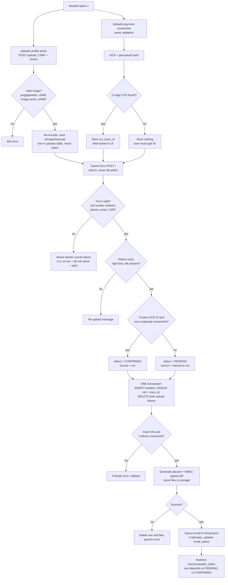
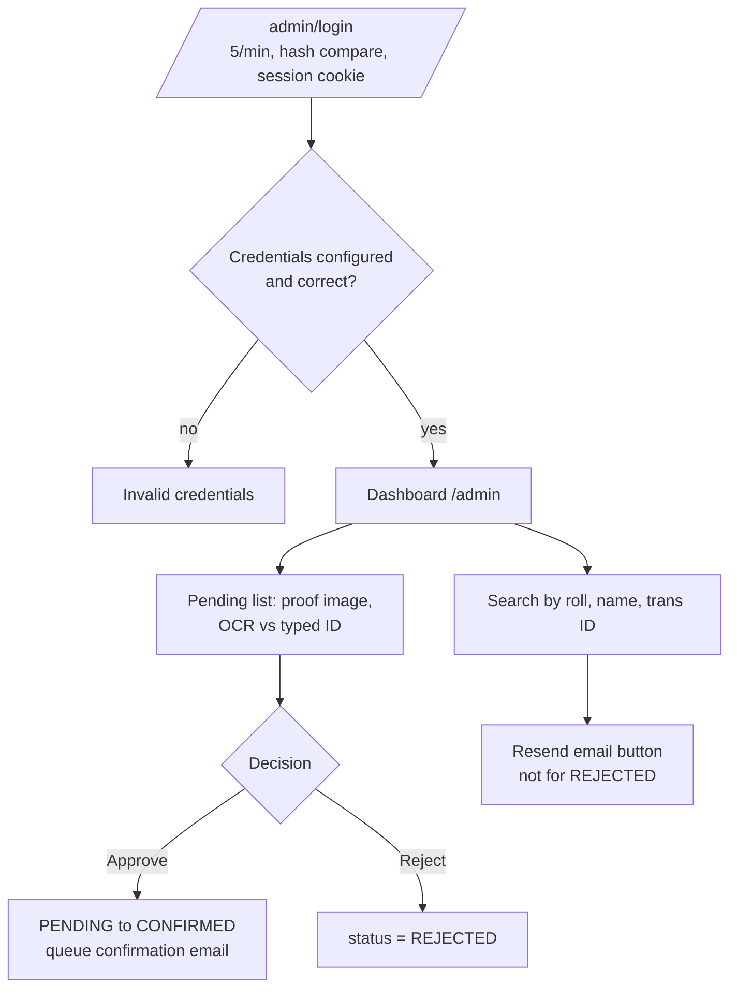
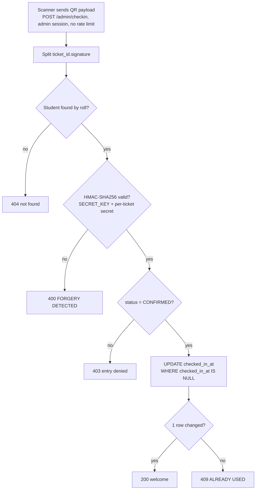

# System Flow (after phase4 hardening)

## 1. Registration

```mermaid
flowchart TD
    A[Student opens /] --> B[Uploads profile photo<br/>POST /upload, CSRF + 15/min]
    B --> B1{Valid image?<br/>png/jpg/webp, ≤5MB,<br/>Image.verify, ≤25MP}
    B1 -- no --> BX[400 error]
    B1 -- yes --> B2[Re-encode, save storage/tmp/uuid<br/>row in uploads table, return token]
    A --> C[Uploads payment screenshot<br/>same validation]
    C --> C1[OCR + perceptual hash]
    C1 --> C2{12-digit UTR found?}
    C2 -- yes --> C3[Store ocr_trans_id<br/>field locked in UI]
    C2 -- no --> C4[Store nothing<br/>user must type ID]
    B2 --> D
    C3 --> D
    C4 --> D
    D[Submit form POST /<br/>tokens, never file paths] --> E{Form valid?<br/>roll number whitelist,<br/>phone, email, CSRF}
    E -- no --> E1[Abuse tracker counts failure<br/>5 in 15 min = 30 min block + alert]
    E -- yes --> F{Tokens exist,<br/>right kind, file present?}
    F -- no --> FX[Re-upload message]
    F -- yes --> G{Trusted OCR ID and<br/>not a duplicate screenshot?}
    G -- yes --> H[status = CONFIRMED<br/>source = ocr]
    G -- no --> I[status = PENDING<br/>source = manual or ocr]
    H --> J
    I --> J
    J[ONE transaction:<br/>INSERT student, UNIQUE roll + trans_id,<br/>DELETE both upload tokens] --> J1{Insert OK and<br/>2 tokens consumed?}
    J1 -- no --> JX[Friendly error, rollback]
    J1 -- yes --> K[Generate placard + HMAC-signed QR<br/>move files to storage/]
    K --> K1{Success?}
    K1 -- no --> KX[Delete row and files,<br/>generic error]
    K1 -- yes --> L[Queue email in thread pool<br/>3 attempts, updates email_status]
    L --> M[Redirect /success/public_token<br/>text depends on PENDING or CONFIRMED]
```

## 2. Admin review

```mermaid
flowchart TD
    A[/admin/login<br/>5/min, hash compare, session cookie/] --> B{Credentials configured<br/>and correct?}
    B -- no --> BX[Invalid credentials]
    B -- yes --> C[Dashboard /admin]
    C --> D[Pending list: proof image,<br/>OCR vs typed ID]
    D --> E{Decision}
    E -- Approve --> F[PENDING to CONFIRMED<br/>queue confirmation email]
    E -- Reject --> G[status = REJECTED]
    C --> H[Search by roll, name, trans ID]
    H --> I[Resend email button<br/>not for REJECTED]
```

## 3. Gate check-in

```mermaid
flowchart TD
    A[Scanner sends QR payload<br/>POST /admin/checkin, admin session, no rate limit] --> B[Split ticket_id.signature]
    B --> C{Student found by roll?}
    C -- no --> CX[404 not found]
    C -- yes --> D{HMAC-SHA256 valid?<br/>SECRET_KEY + per-ticket secret}
    D -- no --> DX[400 FORGERY DETECTED]
    D -- yes --> E{status = CONFIRMED?}
    E -- no --> EX[403 entry denied]
    E -- yes --> F[UPDATE checked_in_at<br/>WHERE checked_in_at IS NULL]
    F --> G{1 row changed?}
    G -- yes --> H[200 welcome]
    G -- no --> I[409 ALREADY USED]
```
